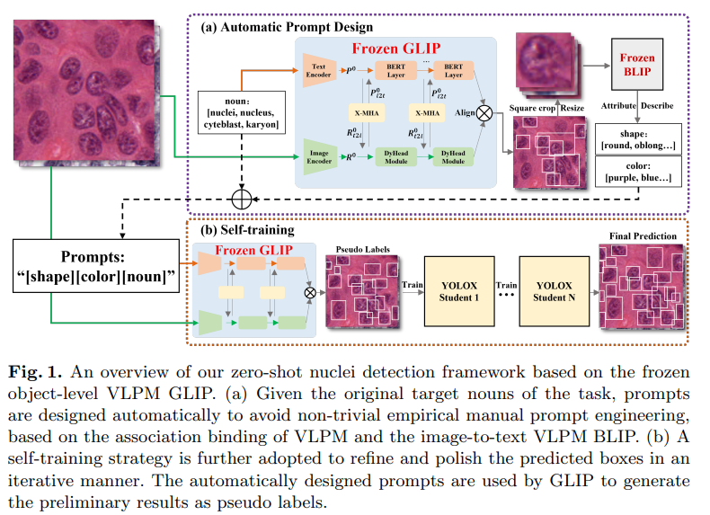

# Zero-shot Nuclei Detection via Visual-Language Pre-trained Models



Official implementation of Zero-shot Nuclei Detection via Visual-Language Pre-trained Models.
The original paper link is here:
[arXiv link](https://arxiv.org/abs/2306.17659), [MICCAI link](to be update).
The proposed method has two process steps:
1. Generating raw GLIP prediction results.Code for this step is [here](https://github.com/wuyongjianCODE/VLPMNuD).
2. Self-training via YOLOX.
This repository only provides source code for the second step. 
## Installation
1. Create a Python environment based on the ```requirements.txt``` file.

2. Build up YOLOX.
Our project is developed based on YOLOX. Open the main directory and run:

```bash 
python setup.py develop
```

## Data Prepare
In the path ```datasets/COCO/annotations/```, we placed some example raw GLIP prediction result (.json format) for quickly start. We recommend to use ```instances_train2017_best_raw_glip.json``` among thses files to reproduce our experiment result.

## Self-training via YOLOX

Step 1:Train a new student via YOLOX:
```bash 
python tools/train.py -f exps/default/yolox_s.py -d 1 -b 1 --fp16 
```
Step 2:After that, if you want to repeat the self-training , take current student as a teacher and train a better student. You need to first employ the current student to prepare the pseudo-label, run:
```bash 
python eval_and_regenerate_trainset.py -f exps/default/yolox_s.py -c "YOLOX_outputs/yolox_s/best_ckpt.pth" -b 1 -d 1 --conf 0.001 --fp16 --fuse
```
A new ```instance_train2017.json``` generated from the last student will replace the original label file at the path ```datasets/COCO/annotations/```. It means now the last student will perform as a teacher, and provide its "pseudo label" to the next coming student.It is time to run Step 1 again.

You can repeat Step 1 and 2 until you meet satisfactory result. Normally, repeating 1 ~ 4 times should be sufficient. Sometimes the first student learns the best, but he teaches bad.

## Citation

If you use VLPM in your work or wish to refer to the results published in this repo, please cite our paper:
```BibTeX
@inproceedings{wu2023zero,
  title={Zero-shot Nuclei Detection via Visual-Language Pre-trained Models},
  author={Wu, Yongjian and Zhou, Yang and Saiyin, Jiya and Wei, Bingzheng and Lai, Maode and Shou, Jianzhong and Fan, Yubo and Xu, Yan},
  booktitle={International Conference on Medical Image Computing and Computer-Assisted Intervention},
  pages={},
  year={2023},
  organization={Springer}
}
```


